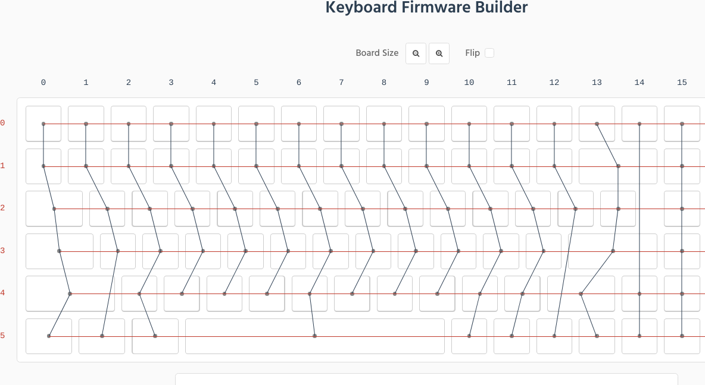

# Keychron K2 Reverse Engineering

This is partial and may or may not be completed.
Use this information at your own discretion and risk.

This is for K2 White Backlight v2 ANSI.

## TODO List - QMK support
- [ ] Ability to safely flash bootloader
- [ ] Ability to revert to factory firmware
- [ ] Confirm Chibios functionality
- [ ] Get QMK Working
- [ ] Get LEDs working
- [ ] Confirm bluetooth functionality

## Chips
* Main MCU - HFD48KP500 

* Bt module [CYPRESS CYW20730A2KFBG](https://www.infinite-electronic.ru/datasheet/2a-CYW20730A2KFBG.pdf)

* Charge IC - TPU5000

## Key Matrix & MCU
[Keyboard Layout ](http://www.keyboard-layout-editor.com/#/gists/592bca6f73c96e2903e64c1be3a7924d)

## MCU-Diagram - Keyboard matrix diagram on the MCU

| --- | col | C0 | C1 | C2 | C3 | C4 | C5 | C6 | C7 | C8 | C9 | C10 | C11 | C12 | C13 | C14 | C15 |
| --- | --- | -- | -- | -- | -- | -- | -- | -- | -- | -- | -- | --- | --- | --- | --- | --- | --- |
| row | pin | 19 | 18 | 17 | 16 | 15 | 14 | 13 | 12 | 11 | 10 |   9 |   8 |   7 |   6 |   5 |   4 |
| R0  |   1 |    |    |    |    |    |    |    |    |    |    |     |     |     |     |     |     |
| R1  |   2 |    |    |    |    |    |    |    |    |    |    |     |     |     |     |     |     |
| R2  |   3 |    |    |    |    |    |    |    |    |    |    |     |     |     |     |     |     |
| R3  |  24 |    |    |    |    |    |    |    |    |    |    |     |     |     |     |     |     |
| R4  |  35 |    |    |    |    |    |    |    |    |    |    |     |     |     |     |     |     |
| R5  |  36 |    |    |    |    |    |    |    |    |    |    |     |     |     |     |     |     |

## MCU-Diagram - LED matrix

| --- | --- | col | C0 | C1 | C2 | C3 | C4 | C5 | C6 | C7 | C8 | C9 | C10 | C11 | C12 | C13 | C14 | C15 |
| --- | --- | --- | -- | -- | -- | -- | -- | -- | -- | -- | -- | -- | --  | --  | --  | --  | --  | --  |
| LED | pin | pin | 19 | 18 | 17 | 16 | 15 | 14 | 13 | 12 | 11 | 10 |   9 |   8 |   7 |   6 |   5 |   4 |
|  02 |  29 | --- | -- | -- | -- | -- | -- | -- | -- | -- | -- | -- | --- | --- | --- | --- | --- | --- |
|  06 |  30 | --- | -- | -- | -- | -- | -- | -- | -- | -- | -- | -- | --- | --- | --- | --- | --- | --- |
|  09 |  31 | --- | -- | -- | -- | -- | -- | -- | -- | -- | -- | -- | --- | --- | --- | --- | --- | --- |
|  12 |  32 | --- | -- | -- | -- | -- | -- | -- | -- | -- | -- | -- | --- | --- | --- | --- | --- | --- |
|  15 |  33 | --- | -- | -- | -- | -- | -- | -- | -- | -- | -- | -- | --- | --- | --- | --- | --- | --- |
|  49 |  34 | --- | -- | -- | -- | -- | -- | -- | -- | -- | -- | -- | --- | --- | --- | --- | --- | --- |

## MCU-Diagram - mac/win and bt/off/cable dip switches

- Bluetooth / O / Cable Mode: pin ?
- Win - Android / Mac - iOS Mode: pin ?

## MCU-Diagram - Status LED indicators - K2 v2 only
- Caps Lock: pin ?
- Num Lock: pin ?

## MCU Pinout - SN32F248BF

## Bluetooth module

seems to be wired like the Blitzwolf BW-KB1(https://github.com/IslamAlam/blitzwolf-bw-kb-1)
